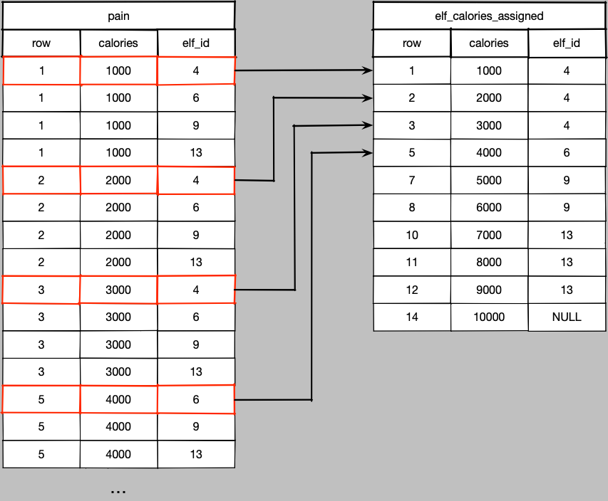

Do you consider yourself an explorer in the furthest regions of programming experience?
Do you like pushing the boundaries of proper practice and good taste when it comes to solving programming problems?
Have you ever wondered - *I bet I could solve that with SQL*?

Me too.
And it turns out in many cases, you can.
Often you *shouldn't*, but you can.
In this post and the next couple I'm going to be exploring the furthest reaches of what we can do with the database language every dev knows at least a little bit of.
And I'm going to be doing this by solving [Advent of Code](https://adventofcode.com) problems.

## The Problem

My first post on this will be the day 1 problem, and will serve as a little teaser of the terrible, terrible things I'm going to show you.
You can familiarize yourself with the problem here, https://adventofcode.com/2022/day/1, but the gist is this:

We get a file with sequences of numbers, one number per line.
The number represents the number of calories of snacks in an elf's bag.
We want to know how many calories the elf carrying the most has in their bag.
We *could* be given labels as a second column for each elf, but that would make things too easy, so instead we get line breaks between elves.


Here, the first elf has 6000 calories, the second 4000, the third 11000.
You get the idea.

We want to know how many calories the elf who's carrying the most calories has.
Can we do it with SQL?
Yes.
Should we?
Doesn't matter we're doin it anyway.

I built this with [Quarto](https://quarto.org/), which is a way of building computational documents.
You can view the raw Quarto Markdown files [in the git repo](https://github.com/timothyrenner/advent-of-code-2022).
There are a few things I've omitted from this post that are Quarto specific but not relevant to the solution - mainly firing up and connecting to an in-memory database.

The database I'm using is [DuckDB](https://duckdb.org/), which is a pretty hot item in the data world right now.
It's the fastest, simplest way to do in-process SQL on tabular data.

For the uninitiated, DuckDB is an in-process OLAP database engine similar to SQLite.
While SQLite is row oriented and weakly typed, DuckDB is columnar and strongly typed.
It's much more than "SQLite for OLAP" though.
Thanks to the magic of [Apache Arrow](https://arrow.apache.org/), DuckDB can function as a SQL engine for tabular data that can read from and write to nearly any data source for tabular data - CSVs, Parquet, even Pandas data frames.
You can take a collection of CSV files and build a full end-to-end data pipeline with it, effectively making it an on-demand miniature data warehouse.

What we're about to do to it takes advantage of almost none of those things.

## Setup

First piece of violence: this is obviously not a csv file.
It has no header, no delimiter, and null rows delimit different elves for all of the values preceding it since the last null value.

It's nothing like a csv but we're gonna call it one so we can read it into DuckDB.
And believe me things are only going downhill from here.

``` sql
CREATE OR REPLACE TABLE elf_calories (calories INTEGER);
COPY elf_calories FROM 'input.csv';
```

``` sql
SELECT COUNT(*) FROM elf_calories
```

| count_star() |
|-------------:|
|         2252 |

1 records

We need to do a little validation to ensure that we read the right values.

``` bash
wc -l input.csv
```

        2252 input.csv

Looks good, at least the rows match.
Validate the schema too to make sure DuckDB isn't doing weird stuff to the types.

``` sql
PRAGMA table_info('elf_calories')
```

| cid | name     | type    | notnull | dflt_value | pk    |
|----:|:---------|:--------|:--------|:-----------|:------|
|   0 | calories | INTEGER | FALSE   | NA         | FALSE |

1 records

Looks good - integers are what we expect.
Double check that the first few rows match the file's head.

``` sql
SELECT * FROM elf_calories
```

| calories |
|---------:|
|     7569 |
|     1357 |
|    10134 |
|     4696 |
|     4423 |
|     8869 |
|     3562 |
|     6597 |
|       NA |
|     4038 |

Displaying records 1 - 10

And now the file...

``` bash
head -n 10 input.csv
```

    7569
    1357
    10134
    4696
    4423
    8869
    3562
    6597

    4038

Alrighty looks like the I/O part is good.
Now the next part is where moderately seasoned programmers can say "well let's write a loop and we'll do a running sum per elf, then pick the one with the max."
Programmers who want to flex a little will say "I'm going to use a reduce and partition_by operation and write it in one line."

We, on the other hand, are working in a language that doesn't even have *variables*, let alone loops.
We have to figure out how to walk along these sequences of numbers and assign some kind of identifier to each list of numbers between the line breaks.

It is possible.
Start by enumerating each row.
We'll use a window function without a window cause at this point nothing's off the table in terms of terrible practices.

**Why is this bad?**
We're relying on the order of the input file to convey information.
Now we are *told* the order matters but how many times have you gotten a dataset where the docs said one thing and you get something different?
In this case, we have to trust the data but in real life - never trust the data.

While I'm here creating the first view I can also make a note when the breaks are that signify a different elf with an indicator column.
This will be important momentarily.

``` sql
CREATE OR REPLACE VIEW elf_calories_counted AS (
    SELECT
        calories,
        ROW_NUMBER() OVER () AS row,
        calories IS NULL AS break,
    FROM elf_calories
);
```

Note that DuckDB has no problem with that final trailing comma on the `SELECT`.
It's really easy to add, remove, and reorder columns because we don't have to keep track of the last column any more.
DuckDB is full of convenient additions to the SQL dialect like this that make life just that much better for analysts and data engineers.
It's 1000x better than *leading* commas, that's for sure.
Don't @ me leading commas look terrible and you know it.
Anyway, here's our table.

``` sql
SELECT * FROM elf_calories_counted ORDER BY row ASC LIMIT 10;
```

| calories | row | break |
|---------:|----:|:------|
|     7569 |   1 | FALSE |
|     1357 |   2 | FALSE |
|    10134 |   3 | FALSE |
|     4696 |   4 | FALSE |
|     4423 |   5 | FALSE |
|     8869 |   6 | FALSE |
|     3562 |   7 | FALSE |
|     6597 |   8 | FALSE |
|       NA |   9 | TRUE  |
|     4038 |  10 | FALSE |

Displaying records 1 - 10

Looks good so far, the first eight rows are for the first elf, as indicated by the `break` column being true on row 9.
Let's check the bottom 10 as well.

``` sql
SELECT * FROM elf_calories_counted ORDER BY row DESC LIMIT 10;
```

| calories |  row | break |
|---------:|-----:|:------|
|     3507 | 2252 | FALSE |
|     7588 | 2251 | FALSE |
|     1229 | 2250 | FALSE |
|     8594 | 2249 | FALSE |
|     7982 | 2248 | FALSE |
|     9613 | 2247 | FALSE |
|     6988 | 2246 | FALSE |
|     6810 | 2245 | FALSE |
|     3997 | 2244 | FALSE |
|       NA | 2243 | TRUE  |

Displaying records 1 - 10

Now comes the fun part.
Notice we can isolate the elves by pulling out all records with `break` equal to true.
We'll have a view with one row per elf *and* an ID for that elf.
Sounds handy, let's do that.

``` sql
CREATE OR REPLACE VIEW elf_calorie_breaks AS (
    SELECT
        row AS elf_id
    FROM elf_calories_counted
    WHERE calories IS NULL
);
```

``` sql
SELECT * FROM elf_calorie_breaks LIMIT 10
```

| elf_id |
|-------:|
|      9 |
|     18 |
|     29 |
|     34 |
|     47 |
|     55 |
|     58 |
|     64 |
|     78 |
|     83 |

Displaying records 1 - 10

So now what do we have?
We have one row ID per elf.
An elf ID, basically.
But not just any elf ID, it's an *ordered* elf ID that can be compared to the row IDs in the original table.
**Each row ID in the original table is going to be less than the elf ID it needs to be assigned to.**

### Abandon Hope

We can attach the elf ID to the rows by performing an **inequality join** between our elf IDs.
Now, pretty much every time you do a real join - like for your job and stuff - it's an equality match between columns in the two tables.
But joins just need a boolean predicate, and you can use any boolean operators (or just `TRUE` for a cross join).
In real life, you usually don't need inequality joins because we design tables to be joined via these newfangled things called *primary and foreign keys*.
Perhaps you have heard of those.

No such luck here though.

BUT it's not as simple as *just* an inequality join because that would assign *every single elf ID* to the first eight rows, then all but the first for the next list of calories, and so forth.
A massive explosion in cardinality.


The solution is straightforward though - we need just the *minimum* elf ID of the possible elf IDs, so throw in a group by and aggregate.



``` sql
CREATE OR REPLACE VIEW elf_calories_assigned AS (
    SELECT
        cal.calories,
        cal.row,
        MIN(elf.elf_id) AS elf_id,
    FROM
        elf_calories_counted AS cal
    LEFT JOIN elf_calorie_breaks AS elf ON
        cal.row < elf.elf_id
    -- Remove the breaks. Wouldn't affect the result when summing but makes
    -- diagnostics simpler.
    WHERE cal.calories IS NOT NULL
    GROUP BY cal.calories, cal.row
);
```

Just take a moment and admire the awfulness of `cal.row < elf.elf_id`.
And think about the edge cases for a second.
What happens to the last elf in the file?
Well, since the file doesn't end with a blank line, there are no elf IDs that satisfy the inequality join above, so we can lose the rows if we're not careful.
Hence a `LEFT JOIN` instead of an `INNER JOIN`.
There is one single NULL elf ID representing that last elf.

Okay enough of that, let's answer the question.
The hard part's over, now it's a trivial `GROUP BY`, aggregation, and `ORDER BY`.

``` sql
SELECT 
    elf_id,
    SUM(calories) AS total_calories,
FROM elf_calories_assigned
GROUP BY elf_id
ORDER BY total_calories DESC
```

| elf_id | total_calories |
|-------:|---------------:|
|   1234 |          xxxxx |
|   1234 |          xxxxx |
|   1234 |          xxxxx |
|   1234 |          xxxxx |
|   1234 |          xxxxx |
|   1234 |          xxxxx |
|   1234 |          xxxxx |
|   1234 |          xxxxx |
|   1234 |          xxxxx |
|   1234 |          xxxxx |

Displaying records 1 - 10

And there's our winner.
What, you didn't think I'd just drop the answer here would you?

## Part 2

Part 2 of the problem is to get the total calories for the top **three** elves.
Now using SQL is an advantage, it's als trivial to answer this with a query with the views we already have.

``` sql
WITH top3 AS (
    SELECT
        elf_id,
        SUM(calories) AS total_calories,
    FROM elf_calories_assigned
    GROUP BY elf_id
    ORDER BY total_calories DESC
    LIMIT 3
) SELECT SUM(total_calories) FROM top3;
```

| sum(total_calories) |
|--------------------:|
|              xxxxxx |

1 records

Piece of cake.
Or cookie.
Or donut.
Probably all of those cause that's a lot of calories and I don't think it's all trail mix.

## Why?

It was fun.
Sort of.

I've got a few more of these as well, this is just a warm up.
Where we're going, this will seem like a memory of heaven.
